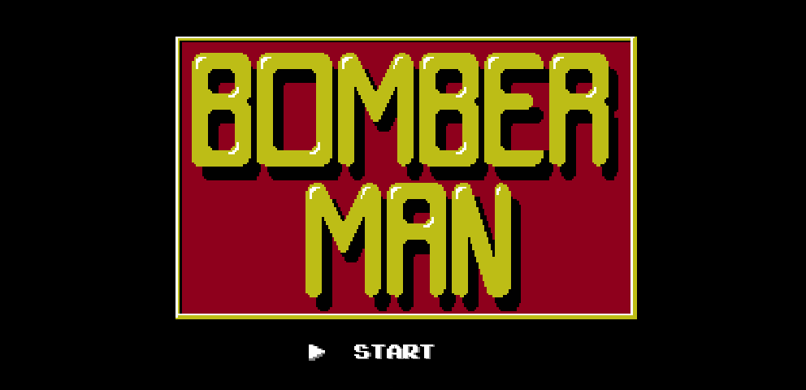
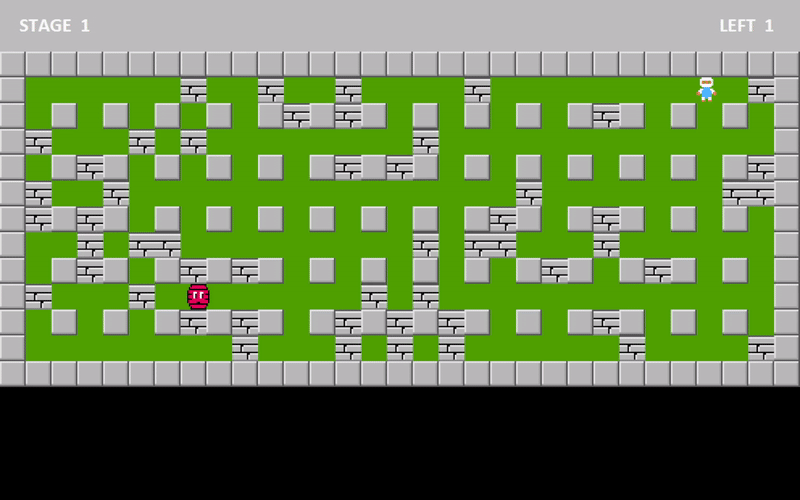
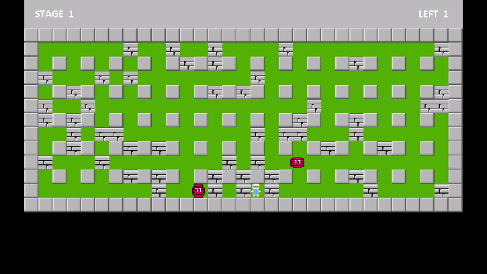
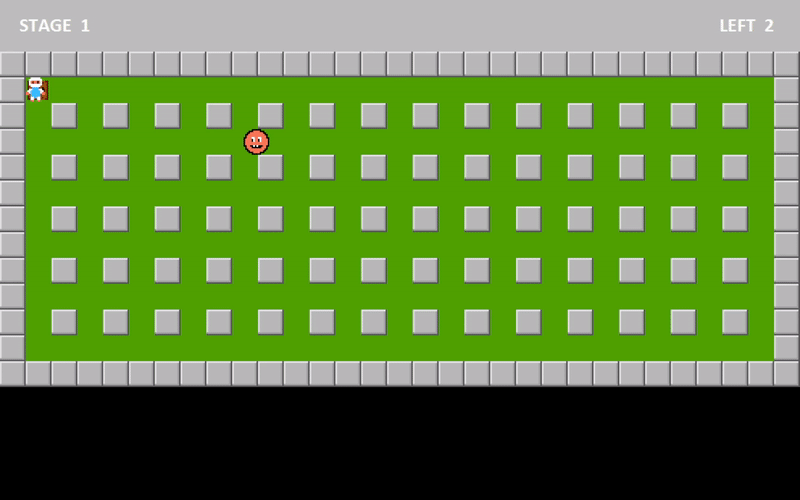
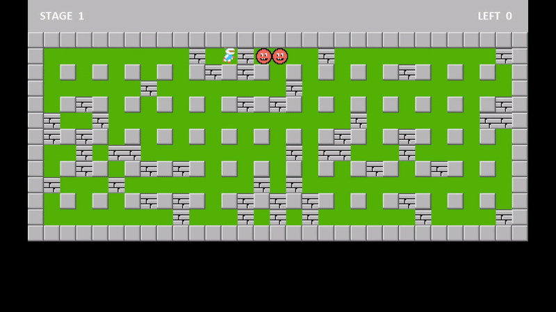
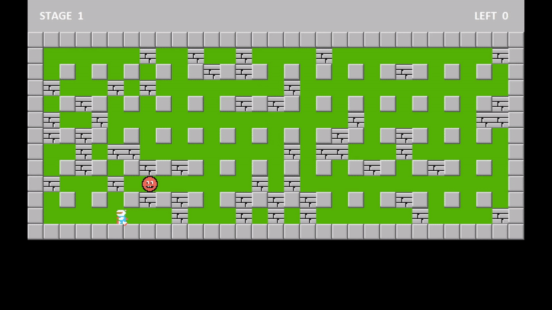
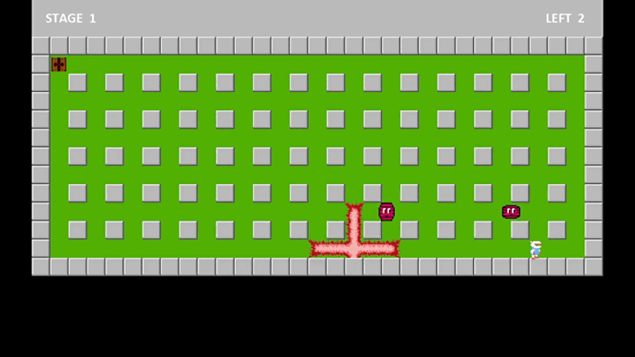

# Bomberman Game with A* Search Algorithm
> 

> 
> 
> 
> 

Hai loại kẻ thù sau đây được thực hiện bằng cách sử dụng A-star
* ** *Minvo:* Di chuyển với tốc độ cao, có khả năng xuyên qua gạch**
> 

* ** *Doll:* Di chuyển với tốc độ cao, khi chỉ còn một thực thể sống sót, nó sẽ tự động sinh ra một con nữa**
> 

Ngoài ra, trò chơi cũng có các loại kẻ thù sau đây:
* ** *Balloon:* Kẻ thù di chuyển ngẫu nhiên với tốc độ chậm**
* ** *Oneal:* Kẻ thù di chuyển ngẫu nhiên với tốc độ thay đổi ngẫu nhiên**
* ** *Kondoria:* Kẻ thù di chuyển ngẫu nhiên với tốc độ thay đổi, có khả năng xuyên qua gạch**

## Hướng dẫn:

* **Di chuyển: A, S, D, W hoặc các phím mũi tên**
* **Đặt bom: Space or X**

## Cài đặt:
Ngôn ngữ Java, thư viện Javafx
